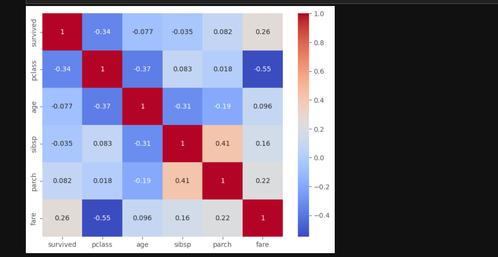
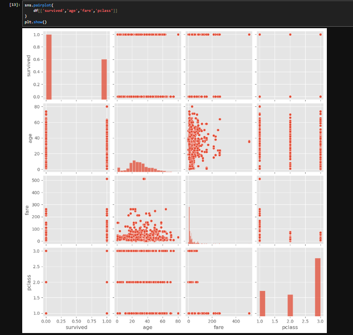

# 🚢 Titanic Dataset - Exploratory Data Analysis (EDA)


## 📌 Project Overview

This project presents an **Exploratory Data Analysis (EDA)** of the Titanic dataset using Python. The analysis focuses on understanding the dataset through statistical summaries and visualizations to identify patterns, trends, correlations, and anomalies.

This project was completed as part of a **Data Analyst Internship Task**.

---

## 🎯 Objectives

- Explore the structure of the dataset.
- Analyze numerical and categorical variables.
- Identify missing values and outliers.
- Visualize relationships between features.
- Extract meaningful business insights.

---

## 🛠️ Technologies Used

| Tool | Purpose |
|------|---------|
| Python | Programming Language |
| Pandas | Data Manipulation |
| NumPy | Numerical Computing |
| Matplotlib | Data Visualization |
| Seaborn | Statistical Visualization |
| Jupyter Notebook | Development Environment |

---

## 📂 Dataset

The Titanic dataset contains passenger information including:

- Passenger Class
- Name
- Age
- Gender
- Fare
- Embarked Port
- Number of Siblings/Spouses
- Number of Parents/Children
- Survival Status

---

## 🔍 Exploratory Data Analysis

The following analyses were performed:

- ✔ Dataset Inspection
- ✔ Statistical Summary
- ✔ Missing Value Analysis
- ✔ Duplicate Check
- ✔ Histograms
- ✔ Boxplots
- ✔ Scatter Plots
- ✔ Pairplot
- ✔ Correlation Heatmap
- ✔ Countplots

---

## 📊 Key Findings

- Female passengers had a much higher survival rate than male passengers.
- First-class passengers were more likely to survive.
- Higher ticket fares were associated with better survival chances.
- Most passengers belonged to the third passenger class.
- Fare contained several outliers.
- Missing values were present mainly in the Age column and were handled using median imputation.

---

## 📁 Project Structure

```text
Task-5-EDA-Titanic/
│
├── Titanic_EDA.ipynb
├── Titanic_EDA_Report.pdf
├── titanic.csv
├── requirements.txt
├── README.md
└── images/
```

---

## 🚀 How to Run the Project

### Clone the repository

```bash
git clone https://github.com/your-username/Task-5-EDA-Titanic.git
```

### Navigate into the project

```bash
cd Task-5-EDA-Titanic
```

### Install dependencies

```bash
pip install -r requirements.txt
```

### Launch Jupyter Notebook

```bash
jupyter notebook
```

Open **Titanic_EDA.ipynb** and run all cells.

---

## 📈 Sample Visualizations

You can add screenshots of your plots inside the **images/** folder.

Example:

```markdown



```

---

## 📚 Learning Outcomes

This project helped in understanding:

- Data preprocessing
- Exploratory Data Analysis
- Statistical summaries
- Data visualization
- Correlation analysis
- Handling missing values
- Detecting outliers

---

## 📌 Repository Contents

| File | Description |
|------|-------------|
| Titanic_EDA.ipynb | Jupyter Notebook containing the analysis |
| Titanic_EDA_Report.pdf | Summary report |
| titanic.csv | Dataset |
| requirements.txt | Required Python libraries |
| README.md | Project documentation |

---

## 👨‍💻 Author

**Your Name**

Data Analyst Intern

GitHub: https://github.com/mahimasebastian

---

## ⭐ Acknowledgements

This project was completed as part of a Data Analyst Internship to strengthen practical skills in Python, data analysis, and visualization.

If you found this project useful, feel free to ⭐ the repository.
